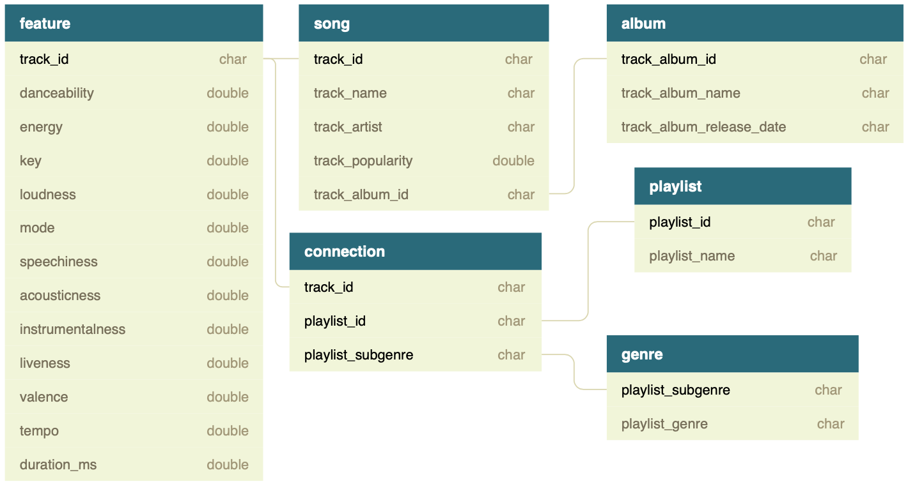
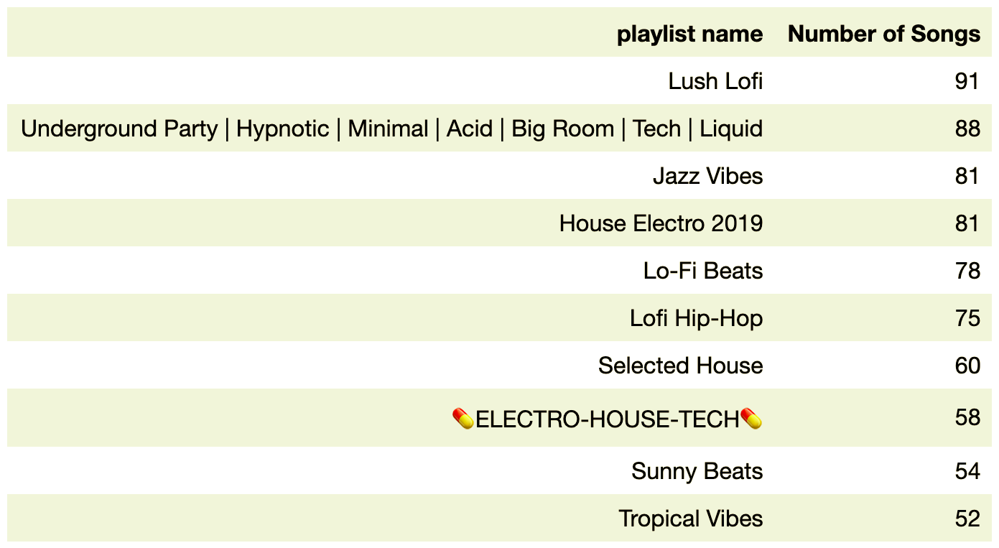

# Creating a SQLite3 Schema Using Spotify Dataset

## Introduction

This blog is to create a SQLite3 schema to store [Spotify Songs Dataset](https://github.com/rfordatascience/tidytuesday/blob/master/data/2020/2020-01-21/readme.md). This schema should follow the [normalization](https://en.wikipedia.org/wiki/Database_normalization) rule to reduce data redundancy and prevent inconsistencies on insertion, update and deletion. Normalization design technique divides large tables into smaller pieces and uses some relationships to connect them. The main normal forms applied in this project are First normal form (1NF), Second normal form (2NF) and Third normal form (3NF). They are defined as

- First normal form  
    - Table has a primary key  
    - No repeating groups of columns  
    - Each cell contains a single value  
- Second normal form  
    - All columns in each row depend fully on candidate keys  
- Third normal form  
    - No transitive dependencies between non-candidate columns

## Spotify Dataset

The Spotify dataset used in this project comes form the **spotifyr** package authored by Charlie Thompson, Josiah Parry, Donal Phipps, and Tom Wolff. This package collects information about songs through Spotify's API. The dataset can be gained through the following code in Python:

```python
import pandas as pd

spotify_songs = pd.read_csv('https://raw.githubusercontent.com/rfordatascience/tidytuesday/master/data/2020/2020-01-21/spotify_songs.csv')
```

The codebook of this dataset can be read [here](https://github.com/rfordatascience/tidytuesday/blob/master/data/2020/2020-01-21/readme.md#data-dictionary). It has 32833 rows and 23 columns, which is too tedious and hard to analyze. Thus detailed dissection is necessary.

## Data Cutting

Based on 1NF, 2NF, 3NF as well as personal preference, the Spotify Song dataset will be divided into 6 parts. The result is shown as below.

|Table|Variables|Primary Key|Shape|
|:---:|:-------:|:---------:|:---:|
|**song**|`track_id`, `track_name`, `track_artist`, `track_popularity`, `track_album_id`|`track_id`|(28356, 5)|
|**album**|`track_album_id`, `track_album_name`, `track_album_release_date`|`track_album_id`|(22545, 3)|
|**playlist**|`playlist_id`,`playlist_name`|`playlist_id`|(471, 2)|
|**genre**|`playlist_subgenre`, `playlist_genre`|`playlist_subgenre`|(24, 2)|
|**feature**|`track_id`, `danceability`, `energy`, `key`, `loudness`, `mode`, `speechiness`, `acousticness`, `instrumentalness`, `liveness`, `valence`, `tempo`, `duration_ms`|`track_id`|(28356, 13)|
|**connection**|`track_id`, `playlist_id`, `playlist_subgenre`|`track_id`, `playlist_id`, `playlist_subgenre`|(32833, 3)|

The relationships between these tables can be visualized below.



## Create a SQLite3 schema

To transform pandas DataFrames into SQLite tables, the package **sqlite3** can be applied for implementation. The codes are shown in [the jupyter notebook](./Spotify_SQLite3_Schema.ipynb).

## Problem Solution

Based on the constructed SQLite schema, the names of all playlists that contain instrumentals can be found. The threshold of judging whether instrumentals are contained is given in the definition of variable `instrumentalness`. The `instrumentalness` with values above 0.5 are intended to represent instrumental tracks. By joining tables **feature**, **connection** and **playlist**, the result can be obtained. Since there are too many playlists that satisfy the condition, only the top 10 playlists are listed ordered by the number of songs within them.


